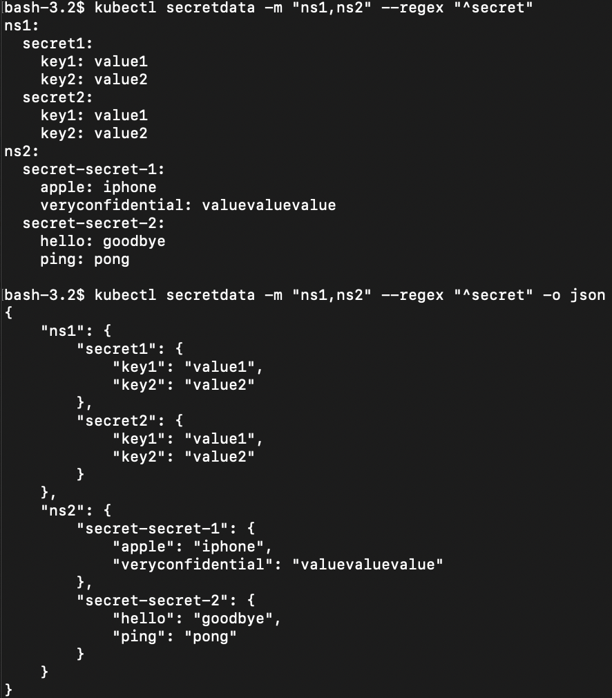

# kubectl-secretdata

[](https://github.com/keisku/kubectl-secretdata/actions/workflows/go_test.yaml)

This plugin provides functions to view decoded Secret data and helpful flags such as regular expression, selecting multiple namespaces, label selectors, etc.



## Motivation

- `kubectl get secret` outputs base64-encoded Secret. It is not easy to verify the real value.
- Wanted functions like regular expression, selecting multiple namespaces to list up Secret data.

## Usage

```
Display decoded secret data.  Prints decoded secret data about the found
secrets.  You can filter the list using a label selector and the --selector flag,
or using --regex. You will only see results in your current namespace unless
you pass --all-namespaces or --multi-namespaces.

Usage:
  secretdata [(-o|--output=json|yaml)] [NAME | -l label] ...) [flags]

Examples:

# List all secrets in json format
kubectl secretdata -A -o json

# List secrets in specified NAMESPACES in yaml form(default)
kubectl secretdata -m "ns1,ns2,ns3"

# List secrets which are matched with regex in specified NAMESPACE
kubectl secretdata -n ns1 --regex "^secret[0-9]"

# List secrets which are matched with labels from all namespaces
kubectl secretdata -A --selector "key1=value1,key2=value2"


Flags:
  -A, --all-namespaces                 If present, list the requested object(s) across all namespaces. Namespace in current context is ignored even if specified with --namespace.
      --as string                      Username to impersonate for the operation. User could be a regular user or a service account in a namespace.
      --as-group stringArray           Group to impersonate for the operation, this flag can be repeated to specify multiple groups.
      --as-uid string                  UID to impersonate for the operation.
      --cache-dir string               Default cache directory (default "/Users/keisukeumegaki/.kube/cache")
      --certificate-authority string   Path to a cert file for the certificate authority
      --client-certificate string      Path to a client certificate file for TLS
      --client-key string              Path to a client key file for TLS
      --cluster string                 The name of the kubeconfig cluster to use
      --context string                 The name of the kubeconfig context to use
  -h, --help                           help for secretdata
      --insecure-skip-tls-verify       If true, the server's certificate will not be checked for validity. This will make your HTTPS connections insecure
      --kubeconfig string              Path to the kubeconfig file to use for CLI requests.
      --match-server-version           Require server version to match client version
  -m, --multi-namespaces string        The multi namespacess separated by "," where secrets exist.
  -n, --namespace string               If present, the namespace scope for this CLI request
  -o, --output string                  The format of the result (default "yaml")
      --password string                Password for basic authentication to the API server
      --regex string                   The regular expression for secret name (default ".*")
      --request-timeout string         The length of time to wait before giving up on a single server request. Non-zero values should contain a corresponding time unit (e.g. 1s, 2m, 3h). A value of zero means don't timeout requests. (default "0")
  -l, --selector string                Selector (label query) to filter on, supports '=', '==', and '!='.(e.g. -l key1=value1,key2=value2)
  -s, --server string                  The address and port of the Kubernetes API server
      --tls-server-name string         Server name to use for server certificate validation. If it is not provided, the hostname used to contact the server is used
      --token string                   Bearer token for authentication to the API server
      --user string                    The name of the kubeconfig user to use
      --username string                Username for basic authentication to the API server
```

## Installation

### Krew

Use [krew](https://krew.sigs.k8s.io/) plugin manager to install.
See [the guide](https://krew.sigs.k8s.io/docs/user-guide/setup/install/) to install [krew](https://krew.sigs.k8s.io/).

```bash
kubectl krew install secretdata
kubectl secretdata --help
```

### Download the binary

Download the binary from [GitHub Releases](https://github.com/keisku/kubectl-secretdata/releases) and drop it in your `$PATH`.

#### Linux

```shell
curl -L -o kubectl-secretdata.tar.gz https://github.com/keisku/kubectl-secretdata/releases/download/v1.0.5/kubectl-secretdata_v1.0.5_linux_amd64.tar.gz
tar -xvf kubectl-secretdata.tar.gz
sudo mv kubectl-secretdata /usr/local/bin
```

#### Darwin(amd64)

```shell
curl -L -o kubectl-secretdata.tar.gz https://github.com/keisku/kubectl-secretdata/releases/download/v1.0.5/kubectl-secretdata_v1.0.5_darwin_amd64.tar.gz
tar -xvf kubectl-secretdata.tar.gz
sudo mv kubectl-secretdata /usr/local/bin
```

#### Darwin(arm64)

```shell
curl -L -o kubectl-secretdata.tar.gz https://github.com/keisku/kubectl-secretdata/releases/download/v1.0.5/kubectl-secretdata_v1.0.5_darwin_arm64.tar.gz
tar -xvf kubectl-secretdata.tar.gz
sudo mv kubectl-secretdata /usr/local/bin
```

#### Source

```shell
go install github.com/keisku/kubectl-secretdata@latest
sudo mv $GOPATH/bin/kubectl-secretdata /usr/local/bin
```

#### Validation

Validate if `kubectl secretdata` can be executed.
[The Kubernetes documentation](https://kubernetes.io/docs/tasks/extend-kubectl/kubectl-plugins/#using-a-plugin) explains how to use a plugin.

```shell
kubectl secretdata --help
```
